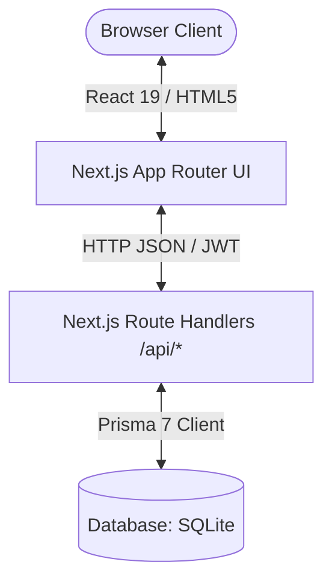

# POD--Flik: 1Cell.AI Inventory Tracking System

A unified full-stack laboratory inventory tracking and order management system built entirely on Next.js 16, TypeScript, Prisma 7, and shadcn/ui.

---

##  Architecture Overview

The application has been migrated from a decoupled FastAPI + Next.js stack into a unified full-stack Next.js application. Next.js handles both the front-end user interface and the back-end API route handlers (`/api/*`) end-to-end.



- **Frontend**: Next.js App Router (React 19) styled with Tailwind CSS v4 and shadcn/ui components.
- **Backend**: Next.js Route Handlers (`/api/*`) processing business transactions, security, JWT authentication, and excel importing/exporting.
- **Database**: Prisma 7 ORM with SQLite, utilizing `@prisma/adapter-better-sqlite3` and the `better-sqlite3` driver.

---

##  Database Connection (Prisma 7)

Prisma 7 uses explicit JavaScript driver adapters for SQLite connectivity rather than default Rust engines.

### 1. Connection String Resolution
Environment variables are resolved in `prisma.config.ts` and loaded via `dotenv/config`. The connection URL defaults to a local SQLite database file:
```typescript
DATABASE_URL="file:./dev.db"
```

### 2. Adapter Configuration
The database client is initialized in `lib/prisma.ts` utilizing the `PrismaBetterSqlite3` adapter:
```typescript
import { PrismaClient } from "@prisma/client";
import { PrismaBetterSqlite3 } from "@prisma/adapter-better-sqlite3";
import "dotenv/config";

const getPrisma = () => {
  const dbUrl = process.env.DATABASE_URL || "file:./dev.db";
  const adapter = new PrismaBetterSqlite3({ url: dbUrl });
  return new PrismaClient({ adapter });
};
```

---

##  API Route Handlers

The backend logic is served via Next.js App Router dynamic API routes:
- **Authentication**: `/api/register`, `/api/login`, `/api/me` (stateless JWTs).
- **Inventory Items**: `/api/items` (GET/POST), `/api/items/[id]` (PUT/DELETE), `/api/items/[id]/transaction` (POST use/restock).
- **Categories & Types**: `/api/item-types` (GET/POST), `/api/item-types/[id]` (PUT/DELETE).
- **Comments & Notifications**: `/api/items/[id]/comments` (GET/POST), `/api/item-comments/[id]` (DELETE), `/api/comments/notifications` (GET), `/api/items/[id]/comments/read` (POST), `/api/item-types/[id]/comments/read` (POST).
- **Audit Logs**: `/api/audit-logs` (GET).
- **User Administration**: `/api/users` (GET/POST), `/api/users/[id]` (DELETE).
- **Order Management**: `/api/orders` (GET/POST), `/api/orders/import` (POST Excel parse), `/api/orders/export` (GET Excel sheet), `/api/orders/[id]/documents` (GET/POST), `/api/order-documents/[id]/download` (GET file stream).

---

##  Frontend (Next.js & shadcn/ui)

The UI has been updated to integrate shadcn/ui components styled with Tailwind CSS v4 variables:
- **Framework**: Next.js 16 App Router.
- **Components**: Standard components (buttons, tables, inputs, dialogs, selects) use shadcn/ui primitives.
- **Styling**: Tailwind CSS v4 configured with HSL variables for automatic light/dark mode compliance in `app/globals.css`.

---

##  Running the Application Locally

### Prerequisites
Ensure you have **Node.js 18+** installed.

### 1. Install Dependencies
Install all package dependencies:
```bash
npm install
```

### 2. Configure Database & Environment
Run the Prisma migration to sync the database schema and generate the local client:
```bash
npx prisma db push
```

### 3. Bootstrap Admin User
Start the Next.js server first:
```bash
npm run dev
```
The application will open on `http://localhost:3000` (or `http://localhost:3001` if port 3000 is occupied).
Since the SQLite database starts empty, the first user registered via the UI registration page (or via curl below) is automatically promoted to the **Admin** role:
```bash
curl -X POST http://localhost:3000/api/register \
  -H "Content-Type: application/json" \
  -d '{"username": "admin", "password": "yourpassword"}'
```

### 4. Running Validation Tests
To verify all database transactions, authentication, and backend API operations, run the automated test suite:
```bash
npx tsx scripts/test-api.ts
```
